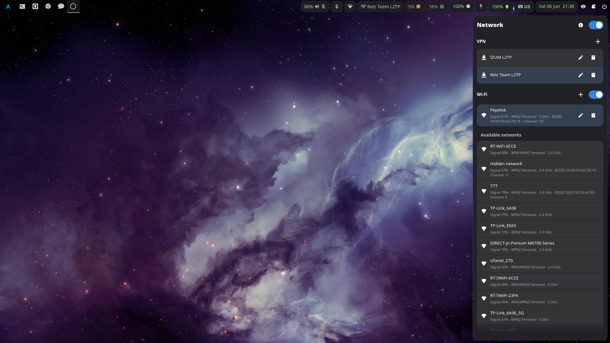

# Network Manager Sidebar



Native GTK4/libadwaita NetworkManager sidebar for Wayland desktops. It can be opened from the CLI, app launchers, hotkeys, or Waybar.

The app opens as a right-side layer-shell panel and provides quick access to wired status, Wi-Fi networks, VPN profiles, and read-only connection details.

## Features

- Toggle, show, hide, or quit the sidebar from repeated CLI invocations.
- Show active wired connections and disconnect them.
- Scan for Wi-Fi networks, connect to saved or open networks, and prompt for WPA/WPA2 passwords.
- Toggle Wi-Fi and global NetworkManager networking.
- List VPN profiles, connect or disconnect them, and open `nm-connection-editor` to create or edit profiles.
- Show active connection information including interface, hardware address, driver, routes, addresses, gateways, DNS, and Wi-Fi details.

## Requirements

- GLib/GIO.
- GTK 4 and libadwaita.
- NetworkManager/libnm.
- `gtk4-layer-shell`.
- `nm-connection-editor` for advanced NetworkManager profile creation, editing, and VPN import flows.

Gtk4LayerShell is required to show the sidebar.

Building from source also requires Meson, Ninja, pkg-config, a C compiler, and the development headers for the libraries above.

## Usage

Build and run from the repository checkout:

```sh
meson setup build
meson compile -C build
./nm-sidebar
```

The default command is `--toggle`. Additional commands are:

```sh
./nm-sidebar --toggle
./nm-sidebar --show
./nm-sidebar --hide
./nm-sidebar --quit
./nm-sidebar --reload-css
./nm-sidebar --background
```

`--show`, `--hide`, `--quit`, `--reload-css`, and the default `--toggle` send commands to an existing background process over a Unix socket. `--background` verifies an existing instance or starts one without showing the sidebar. If no running process is available, `--toggle`, `--show`, and `--background` start the GTK app. `--reload-css` requires an existing running instance.

The socket is created at `$XDG_RUNTIME_DIR/nm-sidebar.sock`, with a fallback under `/tmp/nm-sidebar-$UID/` when `XDG_RUNTIME_DIR` is not set.

## Waybar

Point a Waybar module at the executable, for example:

```json
"on-click": "/path/to/Network_Manager_Sidebar/nm-sidebar --toggle"
```

Use `--background` from your session startup if you want the command server running before the first click.

On multi-output setups, `nm-sidebar` uses Waybar's `WAYBAR_OUTPUT_NAME` environment variable when available. You can also force a connector with `NM_SIDEBAR_OUTPUT=eDP-1 nm-sidebar --toggle`.

## Native Packages

GitHub Actions builds native packages with Meson and nFPM for Debian/Ubuntu (`.deb`), Fedora/RHEL-family systems (`.rpm`), Arch Linux (`.pkg.tar.zst`), and Alpine Linux (`.apk`). Packages install the native CLI as `/usr/bin/nm-sidebar`, the GUI helper as `/usr/libexec/nm-sidebar/nm-sidebar-gui`, and application data under `/usr/share/nm-sidebar/`.

Users can override packaged styles by creating `$XDG_CONFIG_HOME/nm-sidebar/nm-sidebar.css`. If `XDG_CONFIG_HOME` is unset, the app falls back to `~/.config/nm-sidebar/nm-sidebar.css`. Use `nm-sidebar --reload-css` to apply user CSS changes to the running instance without quitting it.

GitHub Actions also publishes AUR source metadata for `nm-sidebar` when the `AUR_SSH_PRIVATE_KEY` GitHub secret is configured. It renders `packaging/aur/PKGBUILD.in` with the tag version and repository URL, computes the source checksum and `.SRCINFO` in an Arch Linux container, then pushes `PKGBUILD` and `.SRCINFO` to `ssh://aur@aur.archlinux.org/nm-sidebar.git`.

Native packages rely on distro-provided GLib, GTK4, libadwaita, NetworkManager/libnm, `gtk4-layer-shell`, and `nm-connection-editor`. The editor dependency is named differently by distro: Arch Linux and Fedora/RHEL-family packages provide it as `nm-connection-editor`, Debian/Ubuntu provide it through `network-manager-gnome`, and Alpine provides `/usr/bin/nm-connection-editor` through `network-manager-applet`. RPM dependency names are Fedora/RHEL-family oriented; other RPM distributions may need adjusted metadata.

## Project Layout

- `nm-sidebar`: checkout launcher for the Meson-built native CLI.
- `src/cli/`: native command-line parsing, IPC probing, and GUI helper startup.
- `src/core/`: command socket protocol, IPC paths, IPC commands, and target-output helpers.
- `src/gui/`: GTK application lifecycle, command server, layer-shell anchoring, and styles.
- `src/actions/`: NetworkManager side-effect facade.
- `src/data/`: NetworkManager data and label helpers.
- `src/sections/`: UI sections for status, VPN, Wi-Fi, and connection information.
- `nm-sidebar.css`: application styles.

## License

Network Manager Sidebar is licensed under the GNU General Public License v3.0 or later. See `LICENSE` for details.

## Development

There is currently no test-suite configuration. Use the focused checks below after edits.

```sh
meson setup build
meson compile -C build
build/nm-sidebar --help
```

Check CLI wiring through the local launcher:

```sh
/home/relz/.local/bin/nm-sidebar --help
```

After changing the Waybar config, reload Waybar with:

```sh
pkill -SIGUSR2 -x waybar
```

When a Wayland graphical session is available, smoke-test the sidebar:

```sh
(./nm-sidebar --show & pid=$!; sleep 2; ./nm-sidebar --quit; wait $pid)
```

Build a native package locally with nFPM:

```sh
rm -rf build-package package-root dist
meson setup build-package --prefix=/usr --libdir=lib --buildtype=release
meson compile -C build-package
DESTDIR="$PWD/package-root" meson install -C build-package
mkdir -p dist
PACKAGE_VERSION=0.0.0 PACKAGE_RELEASE=1 PACKAGE_ARCH=amd64 PACKAGE_HOMEPAGE=https://github.com/Relz/network-manager-sidebar nfpm package --config packaging/nfpm.yaml --packager deb --target dist/
```
