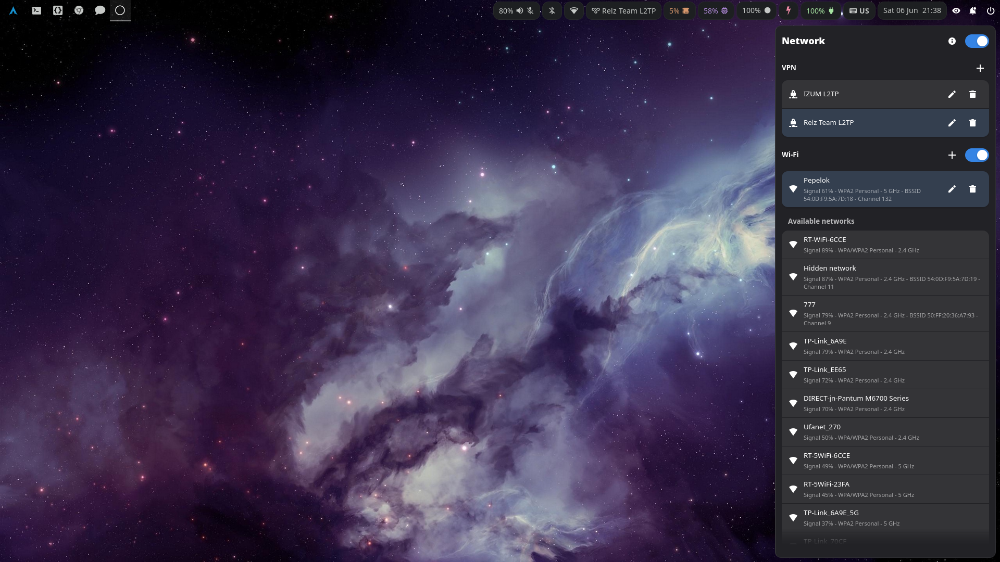

# Network Manager Sidebar



Native GTK4/libadwaita NetworkManager sidebar for Wayland desktops. Opens as a right-side panel from the CLI, app launchers, hotkeys, or Waybar.

## Features

- View Ethernet status and disconnect wired connections.
- Scan and connect to Wi-Fi networks, enter passwords, and toggle Wi-Fi or global networking.
- Connect and disconnect VPN profiles; use `nm-connection-editor` for advanced profile setup and editing.
- Import, replace, connect, disconnect, and remove AmneziaWG profiles.
- Inspect connection details, including addresses, routes, DNS, and Wi-Fi information.

## Installation

On Arch Linux, install [`nm-sidebar`](https://aur.archlinux.org/packages/nm-sidebar) from the AUR.

Prebuilt packages are also available in [GitHub Releases](https://github.com/Relz/network-manager-sidebar/releases): Debian/Ubuntu (`.deb`), Fedora/RHEL-family (`.rpm`), Arch Linux (`.pkg.tar.zst`), or Alpine Linux (`.apk`).

Requires a Wayland compositor with layer-shell support and these dependencies:

- GTK4, libadwaita 1.6+, and `gtk4-layer-shell`.
- GLib/GIO 2.68+ and JSON-GLib 1.6+.
- NetworkManager/libnm and `nm-connection-editor`.
- System D-Bus, `polkit-gobject-1`, and the polkit authority daemon.

For AmneziaWG, follow the [additional setup below](#amneziawg).

### Nix

With [Nix](https://nixos.org/download/) and flakes enabled, run from a checkout:

```sh
nix build
nix run . -- --show
```

The package includes application dependencies and AmneziaWG tools; the host provides NetworkManager, system D-Bus, polkit, and a layer-shell Wayland session. This runs the NetworkManager features; AmneziaWG additionally requires privileged system integration. The documented setup uses the NixOS module below. On other distributions, the service and D-Bus/polkit integration require separate system registration. See the [Nix reference](docs/nix.md) for details, non-flake usage, and development.

### NixOS

With a `nm-sidebar` flake input pointing to `github:Relz/network-manager-sidebar` and `inputs` passed through `specialArgs`, add to your NixOS configuration:

```nix
{ inputs, ... }:
{
  imports = [ inputs.nm-sidebar.nixosModules.default ];

  networking.networkmanager.enable = true;
  programs.nm-sidebar.enable = true;
}
```

See the [complete flake wiring and rebuild command](docs/nix.md#nixos) to apply. The module uses your system's nixpkgs and enables polkit. For AmneziaWG, follow the [Nix setup](docs/nix.md#amneziawg).

## Usage

```sh
nm-sidebar                # Toggle the sidebar (same as --toggle)
nm-sidebar --show         # Show the sidebar
nm-sidebar --hide         # Hide the sidebar
nm-sidebar --quit         # Quit the running instance
nm-sidebar --reload-css   # Reload user CSS
nm-sidebar --background   # Start hidden if not already running
nm-sidebar --help         # Show available options
```

`--toggle`, `--show`, and `--background` start the app if needed. Other control commands require a running instance. Add `nm-sidebar --background` to your session startup to preload the app.

### Waybar and monitors

Add an `on-click` entry to your Waybar module:

```json
{
  "on-click": "nm-sidebar --toggle"
}
```

Waybar's `WAYBAR_OUTPUT_NAME` selects the output automatically. Override it with `NM_SIDEBAR_OUTPUT=eDP-1 nm-sidebar --toggle`.

### Custom styles

Put CSS overrides in `$XDG_CONFIG_HOME/nm-sidebar/nm-sidebar.css` (default: `~/.config/nm-sidebar/nm-sidebar.css`), then run `nm-sidebar --reload-css`.

## AmneziaWG

For conventional packages, install `awg-quick` separately to use AmneziaWG. It must be in `/usr/bin`, `/usr/sbin`, `/bin`, or `/sbin`; copies under `/usr/local` are not used. Profiles with `DNS=` need `systemd-resolved` or a supported `resolvconf` installation. Firewall inspection also requires tools for the relevant backends: `nft`, `iptables-save`, and/or `ip6tables-save`. On NixOS, use the [module above](#nixos).

Access is denied by default, so the AmneziaWG section stays hidden until a local polkit rule grants access. The app does not prompt for an administrator password.

As an administrator, create `/etc/polkit-1/rules.d/49-nm-sidebar-amneziawg.rules` as a root-owned `0644` file, replacing `YOUR_USER` with the allowed login name:

```javascript
polkit.addRule(function(action, subject) {
    if (action.id == "dev.relz.NmSidebar.manage-amneziawg" &&
        subject.user == "YOUR_USER" &&
        subject.local &&
        subject.active) {
        return polkit.Result.YES;
    }
});
```

Polkit reloads rules automatically, and the sidebar updates access without a restart. The rule allows the selected active local user to list and manage AmneziaWG profiles and tunnels.

Use the AmneziaWG section to import local `.conf` files and connect or disconnect profiles. Important behavior:

- Saved profiles are root-owned `0600` files in `/etc/amnezia/amneziawg/`, named `<interface>.conf` with a valid interface name.
- Imports accept local regular files up to 1 MiB, excluding symlinks. Command hooks (`PreUp`, `PostUp`, `PreDown`, `PostDown`) and domain-only `DNS=` values are unsupported.
- Successful import does not guarantee protocol compatibility; `awg` validates it during activation. Replacing a profile overwrites the previous saved configuration.
- Background profile refreshes keep known, available actions usable. Connect, disconnect, import, replace, and remove commands take priority over a refresh: after authorization, the service stops the inventory helper and waits for cleanup before running the command. One user operation runs at a time; selecting a file or confirming an action allows the current refresh to finish until a command is submitted.
- Switching disconnects previous sidebar-managed AmneziaWG sessions before connecting the target. If activation fails, previous sessions are not automatically restored. Switching interrupts connectivity and is not a kill switch.
- Removing an active profile disconnects its sidebar-managed tunnel and verifies runtime cleanup before deleting the saved configuration. Failed cleanup keeps the profile. Externally managed interfaces and tunnels requiring manual intervention remain blocked.
- Tunnels are not configured to start automatically at boot.

## Development

With Nix, follow the [development instructions](docs/nix.md#development).

Install Meson, Ninja, pkg-config, a C compiler, and development headers for the dependencies above. Configure once:

```sh
meson setup build --prefix=/usr --libdir=lib --buildtype=debugoptimized
```

Then build, install, and check the CLI:

```sh
meson compile -C build
sudo meson install -C build
nm-sidebar --help
```

## License

GNU General Public License v3.0 or later. See [LICENSE](LICENSE).
